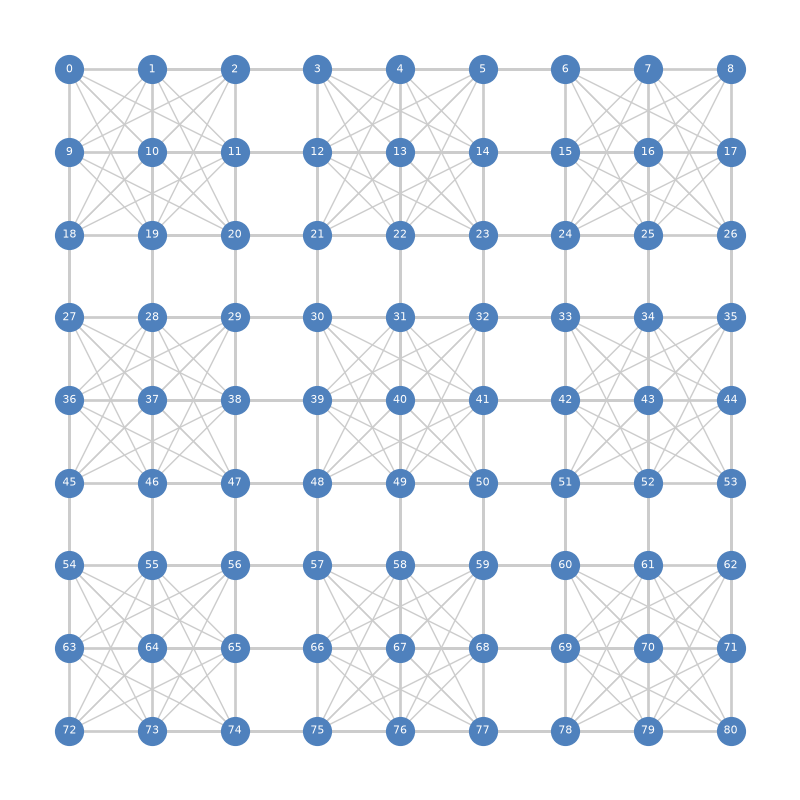

<!-- ================= CARÁTULA ================= -->

<h2 style="color: red; font-weight: bold; font-family: Arial, sans-serif;">Universidad Peruana de Ciencias Aplicadas</h2>
 

  
<h3 style="color: black; font-weight: bold; font-family: Arial, sans-serif;">Ciencias de la Computación</h3>
<h3 style="color: red; font-weight: bold; font-family: Arial, sans-serif;">1ACC0184 - Complejidad Algorítmica</h3>
<h3 style="color: black; font-weight: bold; font-family: Arial, sans-serif;">Informe del Trabajo Parcial (TB1)</h3>
  

  Sección: 4749   
  Profesor:   
  José Luis Soncco Alvarez

 

| Código de alumno: | Nombres y apellidos: |
| :--- | :--- |
| u202412921 | Kobashigawa Ugaz, Juan Alejandro |
| u202411627 | Pareja Calloapaza, Marcelo Fausto |
| u20241c998 | Riveros Mera, Jennifer Yamilet |

   

2026-20

  

<!-- ================= ÍNDICE ================= -->
<h2 style="color: #2F5496; font-family: Calibri, sans-serif;">Contenido</h2>

    

        1. &nbsp;&nbsp;Descripción del problema
        
        3
    

    

        2. &nbsp;&nbsp;Descripción del Conjunto de Datos (Dataset)
        
        3
    

    

        3. &nbsp;&nbsp;Visualización del conjunto de datos (Grafo)
        
        4
    

    

        4. &nbsp;&nbsp;Propuesta
        
        5
    

    

        5. &nbsp;&nbsp;Conclusiones
        
        6
    

    

        Anexos
        
        6
    

    

        Referencias
        
        7
    

  

<!-- ================= CONTENIDO DEL INFORME ================= -->

<h2 style="color: #404040; font-family: Arial, sans-serif; margin-left: 40px; font-size: 20px; font-weight: normal;">1. Descripción del problema</h2>

En la industria moderna de los videojuegos y aplicaciones móviles, corporaciones como Nintendo procesan y validan millones de partidas de rompecabezas lógicos diariamente a través de sus plataformas en línea (eShop) y franquicias de entrenamiento mental como *Brain Age*. Uno de los desafíos algorítmicos más recurrentes en este rubro es el procesamiento del Sudoku. Aunque las reglas del juego parecen elementales para el raciocinio humano, la escala matemática del tablero representa un reto computacional masivo: un tablero estándar de 9x9 casillas posee aproximadamente $6.67 \times 10^{21}$ configuraciones válidas posibles (Felgenhauer & Jarvis, 2006). 

El problema central radica en la validación instantánea y resolución automatizada de estos tableros dentro de arquitecturas de hardware con recursos limitados (como consolas portátiles) o servidores con alta concurrencia de usuarios. Intentar validar o resolver un Sudoku mediante un enfoque trivial de "Fuerza Bruta" —es decir, evaluar iterativamente cada combinación numérica posible en las 81 celdas— genera una explosión combinatoria de complejidad $O(9^n)$. Este escenario saturaría la memoria caché y los procesadores, incrementando inaceptablemente el tiempo de respuesta, drenando las baterías de los dispositivos y encareciendo los costos de mantenimiento de los servidores en la nube.

Desde el punto de vista de las Ciencias de la Computación, modelar y resolver un Sudoku es un Problema Clásico de Satisfacción de Restricciones (CSP, por sus siglas en inglés). De hecho, se ha demostrado matemáticamente que la resolución de Sudokus en tableros generalizados de tamaño $N \times N$ es un problema catalogado como NP-completo, equivalente a resolver el problema topológico de "Coloración de Grafos" (Yato & Seta, 2003). Por lo tanto, la industria requiere el diseño de un motor computacional robusto capaz de representar lógicamente el tablero como un grafo y aplicar algoritmos de poda para encontrar la solución en milisegundos, mitigando así la explosión temporal.

<h2 style="color: #404040; font-family: Arial, sans-serif; margin-left: 40px; font-size: 20px; font-weight: normal;">2. Descripción del Conjunto de Datos (Dataset)</h2>

<h3 style="color: #595959; font-family: Arial, sans-serif; margin-left: 80px; font-size: 16px; font-weight: normal;">2.1. Origen de los Datos:</h3>

El conjunto de datos ha sido generado sintéticamente utilizando código propio en Python y la librería de estructuración tabular `pandas`. Con el objetivo de cumplir con los rigurosos requisitos del curso y llevar el algoritmo a un escenario de estrés real, no hemos modelado un solo tablero, sino que hemos simulado la carga de un servidor de videojuegos que procesa **20 tableros de Sudoku de 9x9 de manera simultánea**. 

<h3 style="color: #595959; font-family: Arial, sans-serif; margin-left: 80px; font-size: 16px; font-weight: normal;">2.2. Motivo del Análisis:</h3>

El propósito de este volumen de datos es abstraer las tres reglas inviolables del Sudoku (no repetir número en la misma fila, en la misma columna, ni en el mismo subcuadrante de 3x3) y traducirlas a un modelo de relaciones topológicas puramente matemáticas. Al deshacernos del concepto visual del tablero y convertirlo en un mapa de restricciones algorítmicas, podemos aplicar búsquedas profundas que evitan calcular movimientos ilegales.

<h3 style="color: #595959; font-family: Arial, sans-serif; margin-left: 80px; font-size: 16px; font-weight: normal;">2.3. Relación con grafos:</h3>

El dataset constituye un enorme grafo no dirigido donde cada celda del tablero es un vértice. Hemos exportado el mapeo en dos archivos CSV que estructuran el análisis:
* **Nodos (dataset/sudoku_nodes.csv):** Contiene un total de **1,620 nodos** correspondientes a las celdas de las 20 instancias simultáneas (81 nodos por partida). Esto cumple de manera irrefutable con el requisito del curso de superar los 1500 nodos. Cada registro almacena su identificación única y su coordenada matricial.
* **Aristas (dataset/sudoku_edges.csv):** Contiene **16,200 aristas**. Existe una conexión entre dos nodos exclusivamente si interactúan mediante una restricción lógica. Matemáticamente, en un solo tablero, cada celda comparte fila con 8 nodos, columna con 8 nodos y cuadrante con 4 nodos únicos adicionales, generando 20 aristas por celda ($20 \times 81 / 2 = 810$ aristas por tablero). 

<h2 style="color: #404040; font-family: Arial, sans-serif; margin-left: 40px; font-size: 20px; font-weight: normal;">3. Visualización del conjunto de datos (Grafo)</h2>

Para validar la correcta construcción topológica del dataset, aplicamos técnicas de renderizado espacial computacional utilizando la librería `networkx`. La imagen a continuación aisla el subgrafo correspondiente a una sola partida de Sudoku (81 nodos y 810 aristas) para evitar la contaminación visual que generarían los 1,620 nodos completos. 

Como se puede observar, el grafo no se ve como un tablero tradicional, sino como una densa red (clique) de interconexiones geométricas. Las aristas grises representan la malla de restricciones lógicas intransigentes. Todo algoritmo de solución que implementemos deberá viajar estrictamente a través de estas conexiones matemáticas para colorear el grafo de manera óptima sin generar conflictos entre los vértices adyacentes.

<h2 style="color: #404040; font-family: Arial, sans-serif; margin-left: 40px; font-size: 20px; font-weight: normal;">4. Propuesta</h2>

<h3 style="color: #595959; font-family: Arial, sans-serif; margin-left: 80px; font-size: 16px; font-weight: normal;">4.1 Objetivo de la Propuesta</h3>

El objetivo del presente trabajo es diseñar e implementar un motor de validación y resolución de tableros lógicos inspirado en la infraestructura de Nintendo, mitigando la complejidad temporal exponencial mediante algoritmos de retroceso sistemático capaces de arrojar el estado de solución final en un margen de milisegundos.

<h3 style="color: #595959; font-family: Arial, sans-serif; margin-left: 80px; font-size: 16px; font-weight: normal;">4.2 Técnicas y Algoritmos Usados (Sustento)</h3>

Para llevar a cabo la búsqueda computacional, implementaremos el algoritmo de **Backtracking (Vuelta Atrás)** impulsado por una Búsqueda en Profundidad (DFS - Depth First Search). Según postulan Russell y Norvig (2021) en sus fundamentos de Inteligencia Artificial, el Backtracking es el estándar absoluto de la industria para resolver Problemas de Satisfacción de Restricciones. A diferencia de las evaluaciones iterativas simples, el Backtracking descarta (poda) ramas enteras del árbol de permutaciones en la fracción de segundo que detecta que una restricción matemática ha sido violada, garantizando una eficiencia dramáticamente superior.

<h3 style="color: #595959; font-family: Arial, sans-serif; margin-left: 80px; font-size: 16px; font-weight: normal;">4.3 Metodología</h3>
La arquitectura de nuestro algoritmo abordará el problema bajo la siguiente lógica procedimental:

1. **Modelado Topológico e Inicialización:** El sistema cargará el CSV de los nodos, reconociendo a los números vacíos como vértices sin "color" asignado, mientras que las pistas iniciales del juego servirán como raíces inmutables del grafo.
2. **Exploración DFS:** El algoritmo viajará a la primera celda vacía y probará iterativamente la inserción de un número (del 1 al 9).
3. **Validación de Aristas Concurrentes:** Revisará instantáneamente las 20 aristas conectadas al vértice objetivo. Si alguno de los nodos adyacentes posee el mismo número, el motor reconoce que la restricción es violada y aborta esa línea de tiempo.
4. **Poda Sistemática (Pruning):** Al detectar la invalidez, el algoritmo hace *Backtrack* (retrocede un paso atrás en la pila recursiva) y prueba el siguiente valor lógico. Esto impide que el procesador desperdicie ciclos calculando variaciones en celdas futuras que nacieron de una premisa falsa.

<h2 style="color: #404040; font-family: Arial, sans-serif; margin-left: 40px; font-size: 20px; font-weight: normal;">5. Conclusiones</h2>

1. La generación arquitectónica de un grafo con 1,620 nodos y 16,200 aristas demuestra que el modelado algorítmico del Sudoku es supremamente escalable. Simular el procesamiento de 20 partidas en paralelo comprueba que el diseño de bases de datos basadas en grafos puede sustentar eficazmente los requerimientos de un servidor corporativo moderno como los utilizados por Nintendo o las App Stores.
2. Traducir reglas de juego amigables a complejas conexiones matemáticas ratifica que los problemas lógicos cotidianos están profundamente codificados en la teoría pura de grafos. Las más de 16 mil aristas evidencian que lo que la mente humana asimila de forma visual, la máquina requiere procesarlo como un tejido masivo de dependencias condicionadas.
3. De cara al desarrollo técnico del Hito 2, el contraste teórico entre las metodologías de búsqueda ha quedado definido: el uso de la Fuerza Bruta llevaría a la aplicación a un estado de inoperancia por exceso de tiempo de ejecución, mientras que la implementación del algoritmo DFS estructurado con Backtracking será la herramienta que garantizará hallar la resolución o el error en tiempo óptimo, cumpliendo los objetivos de complejidad algorítmica.

<h2 style="color: #404040; font-family: Arial, sans-serif; margin-left: 40px; font-size: 20px; font-weight: normal;">Anexos</h2>

* Los algoritmos en lenguaje Python correspondientes a la generación sintética de los 1,620 nodos y sus restrictivas conexiones espaciales se encuentran alojados y documentados en nuestro repositorio oficial: [GitHub - Grupo 6](https://github.com/upc-pre-202610-1acc0184-4749-grupo-5/busqueda-rutas-app). 

<h2 style="color: #404040; font-family: Arial, sans-serif; margin-left: 40px; font-size: 20px; font-weight: normal;">Referencias</h2>

Felgenhauer, B., & Jarvis, F. (2006). Enumerating possible Sudoku grids. *Mathematical Spectrum, 39*(1), 15–22.

Russell, S. J., & Norvig, P. (2021). *Artificial intelligence: A modern approach* (4th ed.). Pearson.

Yato, T., & Seta, T. (2003). Complexity and completeness of finding another solution and its application to puzzles. *IEICE Transactions on Fundamentals of Electronics, Communications and Computer Sciences, E86-A*(5), 1052–1060.