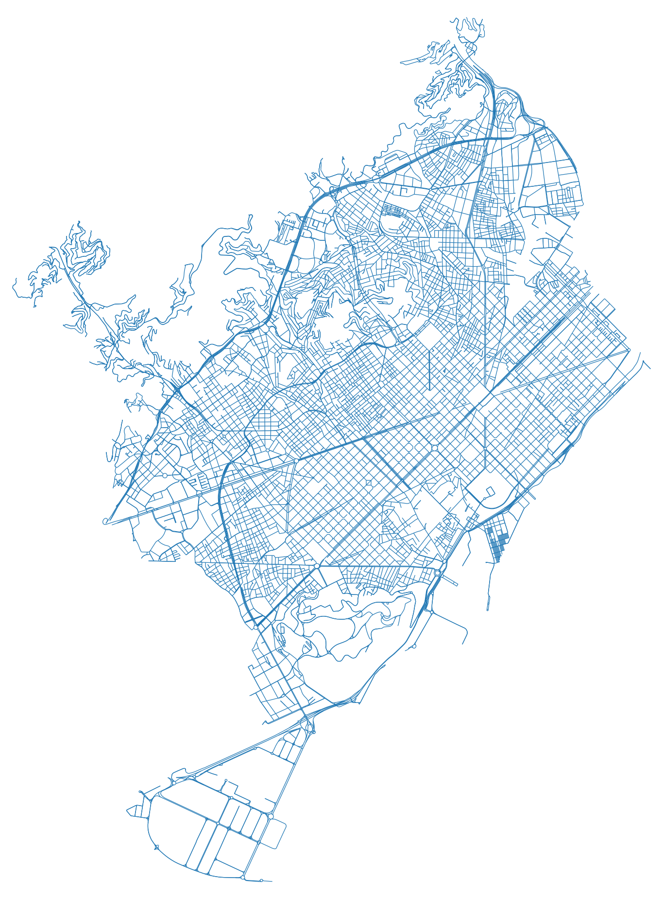

<!-- ================= CARÁTULA ================= -->

<h2 style="color: red; font-weight: bold; font-family: Arial, sans-serif;">Universidad Peruana de Ciencias Aplicadas</h2>
 

  
<h3 style="color: black; font-weight: bold; font-family: Arial, sans-serif;">Ciencias de la Computación</h3>
<h3 style="color: red; font-weight: bold; font-family: Arial, sans-serif;">1ACC0184 - Complejidad Algorítmica</h3>
<h3 style="color: black; font-weight: bold; font-family: Arial, sans-serif;">Informe del Trabajo Parcial (TB1)</h3>
  

  Sección: 4749   
  Profesor:   
  José Luis Soncco Alvarez

 

| Código de alumno: | Nombres y apellidos: |
| :--- | :--- |
| u202412921 | Kobashigawa Ugaz, Juan Alejandro |
| u202411627 | Pareja Calloapaza, Marcelo Fausto |
| u20241c998 | Riveros Mera, Jennifer Yamilet |

   

2026-20

  

<!-- ================= ÍNDICE ================= -->
<h2 style="color: #2F5496; font-family: Calibri, sans-serif;">Contenido</h2>

    

        1. &nbsp;&nbsp;Descripción del problema
        
        3
    

    

        2. &nbsp;&nbsp;Descripción del Conjunto de Datos (Dataset)
        
        3
    

    

        3. &nbsp;&nbsp;Visualización del conjunto de datos (Grafo)
        
        4
    

    

        4. &nbsp;&nbsp;Propuesta
        
        5
    

    

        5. &nbsp;&nbsp;Conclusiones
        
        6
    

    

        Anexos
        
        7
    

    

        Referencias
        
        7
    

  

<!-- ================= CONTENIDO DEL INFORME ================= -->

<h2 style="color: #404040; font-family: Arial, sans-serif; margin-left: 40px; font-size: 20px; font-weight: normal;">1. Descripción del problema</h2>

El crecimiento demográfico y la densificación urbana en las grandes metrópolis europeas, como *Barcelona*, han generado desafíos significativos en la gestión del tráfico y la movilidad vehicular (Àrea Metropolitana de Barcelona, 2025). Conductoras y conductores de transporte público, logística de última milla y vehículos particulares enfrentan retrasos diarios debido a la congestión en la compleja red vial del distrito de L'Eixample y zonas aledañas, lo que subraya la necesidad urgente de mejorar y optimizar la infraestructura de transporte existente para el desarrollo local (Hrushka et al., 2021). 

De hecho, los índices de tráfico recientes revelan cifras alarmantes: recorrer apenas 10 kilómetros en la ciudad toma un promedio de más de 32 minutos, y los conductores pierden aproximadamente 109 horas anuales atrapados en sus vehículos durante las horas punta (TomTom, 2025). 

En este contexto, encontrar la ruta óptima entre dos puntos no solo depende de la distancia física, sino del tiempo de viaje, el cual varía drásticamente según la densidad del tráfico y el sentido de las calles. El problema radica en que los conductores no cuentan con la capacidad mental de procesar en tiempo real las miles de combinaciones de calles para minimizar su traslado, lo que resulta en un aumento de la huella de carbono, mayores costos de combustible y la pérdida de horas productivas. A través de la teoría de grafos, el presente proyecto busca desarrollar un sistema computacional capaz de solucionar este problema encontrando la ruta más corta y eficiente.

<h2 style="color: #404040; font-family: Arial, sans-serif; margin-left: 40px; font-size: 20px; font-weight: normal;">2. Descripción del Conjunto de Datos (Dataset)</h2>

<h3 style="color: #595959; font-family: Arial, sans-serif; margin-left: 80px; font-size: 16px; font-weight: normal;">2.1. Origen de los Datos:</h3>

La extracción de los datos urbanos se realizó de manera automatizada utilizando Python y la librería geoespacial `osmnx`, la cual consume de manera directa la base de datos abierta global de **OpenStreetMap**. 

<h3 style="color: #595959; font-family: Arial, sans-serif; margin-left: 80px; font-size: 16px; font-weight: normal;">2.2. Motivo del Análisis:</h3>

Para el desarrollo de este proyecto, hemos seleccionado la ciudad de **Barcelona, España**, debido a su famosa estructura de red vial en cuadrícula (L'Eixample), diseñada por Ildefons Cerdà. Esta malla ortogonal de calles simétricas constituye un escenario de manual, siendo ideal para la aplicación práctica, comprobación y análisis de eficiencia de los algoritmos de optimización de rutas.

<h3 style="color: #595959; font-family: Arial, sans-serif; margin-left: 80px; font-size: 16px; font-weight: normal;">2.3. Relación con grafos:</h3>

El dataset extraído se ha modelado y exportado en dos archivos CSV que representan el grafo bidireccional de la red vial exclusiva para la conducción de vehículos:
* **Nodos (dataset/intersections.csv):** Contiene **8997 registros**. Cada registro representa un vértice o intersección. Las variables obtenidas son las coordenadas geográficas `y` (latitud), `x` (longitud) y el identificador `osmid`. La cantidad extraída cumple sobradamente con el requisito del curso de superar los 1500 nodos.
* **Aristas (dataset/streets.csv):** Contiene **16702 registros**. Cada registro representa una calle conectando dos nodos (`u` y `v`). Incluye la distancia `length` en metros y el `maxspeed`, que formarán la base matemática de los pesos del grafo.

<h2 style="color: #404040; font-family: Arial, sans-serif; margin-left: 40px; font-size: 20px; font-weight: normal;">3. Visualización del conjunto de datos (Grafo)</h2>

Para validar la correcta extracción del mapa, se utilizó la técnica de renderizado espacial con el módulo `plot_graph` sobre el dataset recolectado. El siguiente grafo generado en color azul evidencia de manera fiel la red de calles transitables de la ciudad, destacando en el centro-derecha la cuadrícula perfecta del distrito L'Eixample atravesada por las arterias diagonales principales.

<h2 style="color: #404040; font-family: Arial, sans-serif; margin-left: 40px; font-size: 20px; font-weight: normal;">4. Propuesta</h2>

<h3 style="color: #595959; font-family: Arial, sans-serif; margin-left: 80px; font-size: 16px; font-weight: normal;">4.1 Objetivo de la Propuesta</h3>

El objetivo principal de esta propuesta es construir un sistema de búsqueda de rutas similar a "Waze", capaz de encontrar el camino óptimo entre dos intersecciones dentro del distrito de L'Eixample y zonas aledañas de Barcelona, minimizando el tiempo de viaje real del usuario según las condiciones dinámicas de tráfico.

<h3 style="color: #595959; font-family: Arial, sans-serif; margin-left: 80px; font-size: 16px; font-weight: normal;">4.2 Técnicas y Algoritmos Usados (Sustento)</h3>

Para realizar la búsqueda de la ruta más corta, implementaremos en la fase de desarrollo el **Algoritmo de Dijkstra**. Elegimos esta técnica por su robustez fundamental en la teoría de grafos. Como explican Cormen et al. (2009), el algoritmo de Dijkstra es matemáticamente óptimo para encontrar caminos mínimos desde un nodo origen único en redes cuyas aristas tienen pesos estrictamente no negativos. Esta propiedad asegura que el sistema jamás entrará en ciclos infinitos y retornará la mejor ruta garantizada.

<h3 style="color: #595959; font-family: Arial, sans-serif; margin-left: 80px; font-size: 16px; font-weight: normal;">4.3 Metodología</h3>

La ciudad se ha representado matemáticamente como un **Grafo Dirigido Ponderado**, donde los vértices representan intersecciones y las aristas son las calles unidireccionales o bidireccionales. 

Con el fin de simular un entorno real, la función de costo (peso) de cada arista no es estática. El enrutamiento de vehículos dependiente del tiempo (*Time-Dependent VRP*) permite ajustar las rutas basándose en fluctuaciones de velocidad por congestión, superando las deficiencias de los grafos estáticos (Adamo et al., 2024). Por ello, calcularemos el costo así:

$$ Peso(e) = Longitud(e) \times FactorTrafico(h) $$

Donde la *Longitud(e)* es la distancia física, y el *FactorTrafico(h)* es un multiplicador que clasificamos mediante código Python en:
* **Hora Punta (Factor alto ~3.0):** De 07:00 a 09:00 y de 17:00 a 20:00 hrs.
* **Horario Regular (Factor moderado ~1.5):** Horas diurnas restantes.
* **Madrugada (Factor mínimo 1.0):** De 23:00 a 05:00 hrs.
Esto asegura que la aplicación desvíe inteligentemente a los conductores de avenidas congestionadas hacia rutas alternativas más rápidas.

<h2 style="color: #404040; font-family: Arial, sans-serif; margin-left: 40px; font-size: 20px; font-weight: normal;">5. Conclusiones</h2>

1. La extracción exitosa de 8,997 nodos y 16,702 aristas mediante la API de OpenStreetMap confirma que es factible y eficiente modelar matemáticamente una red urbana real a gran escala, superando ampliamente el requisito mínimo del proyecto (1500 nodos) y ofreciendo un entorno óptimo de prueba.
2. La definición de un peso dinámico ($Longitud \times Factor Trafico$) resulta ser un enfoque fundamental y realista para el diseño de nuestro aplicativo. Como lo respalda la literatura de logística moderna, basarse únicamente en la distancia física es insuficiente; la penalización algorítmica por congestión en "hora punta" es lo que verdaderamente permite simular un sistema GPS como Waze.
3. Como trabajo a futuro para el próximo hito, se procederá a implementar el Algoritmo de Dijkstra en código Python sobre la matriz del grafo ponderado. Esto permitirá iniciar las pruebas de validación de entradas y salidas, así como el análisis empírico de la complejidad asintótica de las búsquedas en nuestra red vial.

<h2 style="color: #404040; font-family: Arial, sans-serif; margin-left: 40px; font-size: 20px; font-weight: normal;">Anexos</h2>

* El código fuente de extracción y asignación de tráfico se encuentra respaldado en el repositorio GitHub oficial del grupo. Las imágenes del renderizado del grafo constan en la carpeta `assets/`.

<h2 style="color: #404040; font-family: Arial, sans-serif; margin-left: 40px; font-size: 20px; font-weight: normal;">Referencias</h2>

Adamo, T., Gendreau, M., Ghiani, G., & Guerriero, E. (2024). A review of recent advances in time-dependent vehicle routing. *European Journal of Operational Research*, *319*(1), 1–15. https://doi.org/10.1016/j.ejor.2024.06.016

Àrea Metropolitana de Barcelona. (2025). *Dades bàsiques de mobilitat, 2024*. https://hdl.handle.net/20.500.14439/4858

Cormen, T. H., Leiserson, C. E., Rivest, R. L., & Stein, C. (2009). *Introduction to algorithms* (3rd ed.). MIT Press.

Hrushka, V. V., Horozhankina, N. A., Boyko, Z. V., Korneyev, M. V., & Nebaba, N. A. (2021). Transport infrastructure of Spain as a factor in tourism development. *Journal of Geology, Geography and Geoecology*, *30*(3), 429–440. https://doi.org/10.15421/112139

TomTom. (2025). *Barcelona traffic report*. TomTom Traffic Index. https://www.tomtom.com/traffic-index/city/barcelona/